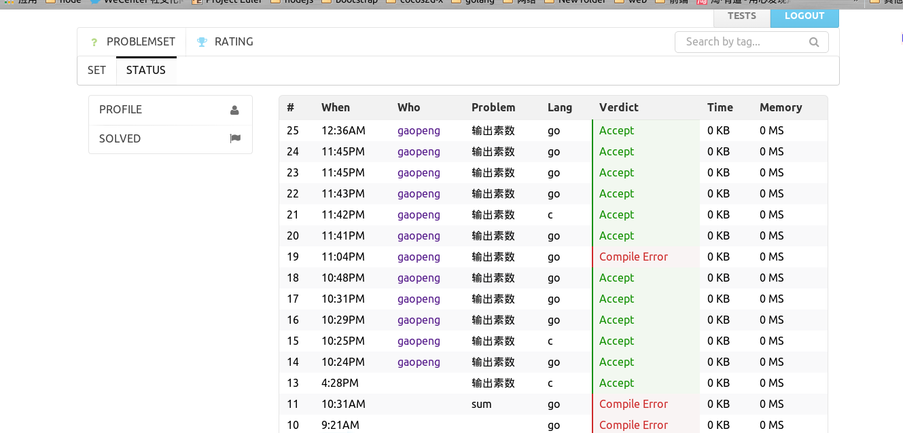

#GO OnlineJudge

###DEMO

###GET DEPENDENCIES
```
./get.sh
```
###RUN PROJECT

modify **conf/app.conf** and **conf/misc.conf** to apply to your enviroment

```
./run.sh
```

###MAKE UBUNTU DOCKER IMAGE

```

//get debootstrap 
sudo apt-get install debootstrap`
//get shell to install ubuntu
wget https://raw.githubusercontent.com/dotcloud/docker/master/contrib/mkimage/debootstrap

chmod +x debootstrap

sudo ./debootstrap raring raring 

sudo tar -C raring -c . | sudo docker import - raring

```

###SET UP SANDBOX FOR CODE TESIING
I take the sandbox from the project as independent package .For details to set up sandbox tool ,please  see : [here](http://github.com/ggaaooppeenngg/sandbox)

###FAQ:

如果遇到DNS问题,需要配置docker的DNS
```
sudo vim /etc/default/docker
# 改成这样，202.118.66.6 是我的计算机的DNS,似乎是需要和计算机的DNS保持一致
# 也可以改成8.8.8.8的公开DNS,计算机上的也DNS也要改成一样的
# Use DOCKER_OPTS to modify the daemon startup options.
# DOCKER_OPTS="--dns 8.8.8.8 --dns 8.8.4.4"k
DOCKER_OPTS="--dns 202.118.66.6 --dns 202.118.66.8"

```

###TODO:

1.  limit the resource of every test instead of total tests
